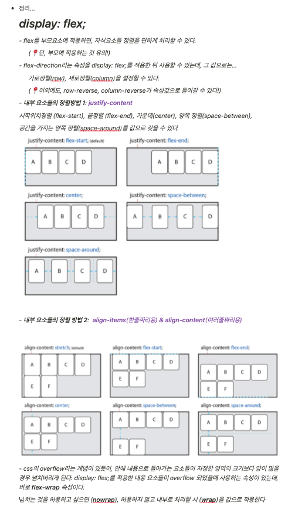

# TIL

> 오늘 공부

- **css 🚩flex🚩**
  - float처럼 옆으로 나열해주는 속성
  - 옆으로 나열하고자 하는 자식들의 부모에게만 flex를 적용
  - display:inline-flex ➡ 인라인 블록으로 대체하면서 옆으로도 나열시키고 싶을 때 사용
    다만 사이에 공백이 생김(공백을 원하지 않는 경우에는 그 위에 부모에게도 flex적용)

 

- **css 🚩flex-direction🚩**
  - row: 가로 정렬
  - column: 세로 정렬

  

- **css 🚩justify-content🚩**
  - 상자들을 어떻게 나열할 것인지 적용시키는 속성 (양옆 기준)
  - flex-start: 시작 위치 정렬
  - flex-end: 끝 정렬
  - center: 가운데 정렬
  - space-between: 양쪽 정렬
  - space-around: 공간을 가지는 양쪽 정렬
  - space-evenly: 양쪽 공간을 동일하게 정렬

   

- **css 🚩align-content(한줄), align-items(여러줄)🚩**
  - 상자들을 어떻게 나열할 것인지 적용시키는 속성 (위 아래 기준)
  - strech: 기본값
  - flex-start: 시작점(위) 정렬
  - flex-end: 끝(아래) 정렬
  - center: 가운데 정렬
  - space-between: 요소간의 가운데 공간 가지는 정렬
  - space-around: 위 가운데 공간을 가지는 양쪽 정렬

 

- **css 🚩flex-wrap🚩**
  - display:flex를 적용시킨 요소들이 overflow된 경우 처리 속성
  - flex-wrap: nowrap ➡ 넘치는 것을 허용
  - flex-wrap: wrap ➡ 허용하지 않고 내부로 처리

   

- **css 🚩order🚩**
  - 먼저 배치하고자 하는 속성에다가 숫자를 부여하면 맨 처음으로 배치 가능

---

-----

CLICK ME!
  

- https://heropy.blog/2018/11/24/css-flexible-box/

</detials>  
